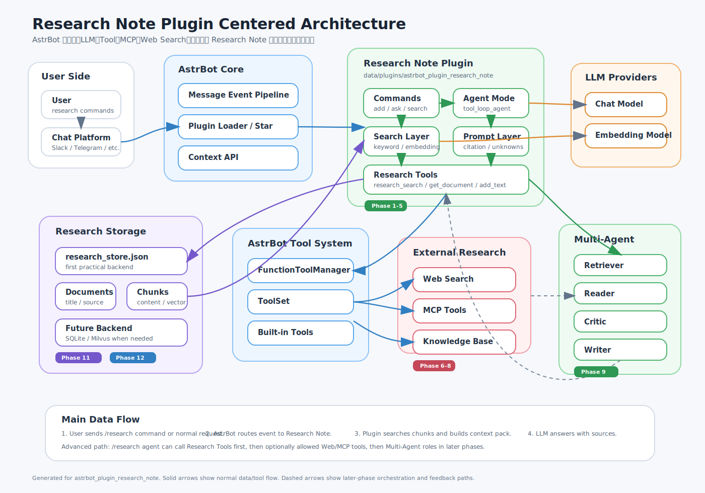

# Research Note for AstrBot

Research Note is a source-grounded research assistant plugin for [AstrBot](https://github.com/AstrBotDevs/AstrBot). It lets you save research materials or source excerpts, retrieve relevant chunks, and ask questions that are answered with explicit source references.

This plugin is being developed toward a lightweight source-grounded research workflow inside AstrBot: collect materials in chat, split them into searchable chunks, ask grounded questions, and gradually extend the system with stronger citations, tools, MCP, web research, and multi-agent workflows.

## Architecture



See `docs/practical_steps/architecture_overview.md` for the diagram guide and feature-level flow diagrams.

## Features

- Save research materials with `/research add <text>`.
- Import text or HTML pages with preview and confirmation.
- Store materials as documents and searchable chunks.
- List stored materials with `/research list`.
- Inspect a stored document with `/research show <doc_id>`.
- Ask source-grounded questions with `/research ask <question>`.
- Run explicit web-assisted research with `/research agent_web <task>` when enabled.
- Run explicit MCP / AstrBot-tool-assisted research with `/research agent_mcp <task>` when enabled.
- Run staged multi-agent research with `/research agent_multi <task>` when enabled.
- Use embedding search through an AstrBot embedding provider.
- Store data in either JSON or SQLite with the same command interface.
- Create a local storage backup with `/research backup`.
- Register LLM tools: `research_search`, `research_get_document`, `research_list_documents`, `research_add_text`, and `research_delete_document`.
- Configure search and safety options through `_conf_schema.json`.
- Follow the practical roadmap toward citation quality, tool use, MCP, and multi-agent research workflows.

## Current Status

Research Note is currently an early `v0.1.0` plugin. The minimal document/chunk RAG flow works, but the plugin is still evolving toward a more practical research assistant.

Implemented core flow:

```text
Add material -> Split into chunks -> Store in JSON or SQLite -> Search relevant chunks -> Build prompt -> Ask LLM -> Return answer with source IDs
```

Planned practical improvements are documented in:

```text
PRACTICAL_ROADMAP.md
docs/practical_steps/README.md
```

An architecture overview is available here:

```text
docs/practical_steps/architecture_overview.md
```

## Commands

```text
/research help
/research add <text>
/research list
/research show <doc_id>
/research show <doc_id> <chunk_index|chunk_id>
/research show <chunk_id>
/research search <query>
/research ask <question>
/research agent <task>
/research agent_web <task>
/research agent_mcp <task>
/research agent_multi <task>
/research import text <text>
/research import url <url>
/research import confirm <pending_id>
/research delete <doc_id> --confirm
/research reindex
/research backup
/research clear --confirm
```

Short aliases are also available: `/research import_text <text>`, `/research import_url <url>`, and `/research import_confirm <pending_id>`.

## Configuration

The plugin currently supports these configuration items:

- `top_k`: Number of relevant materials used for answering.
- `max_note_chars`: Maximum characters included from each matched chunk in the prompt.
- `max_add_chars`: Maximum characters allowed in one `/research add` call.
- `chunk_size`: Approximate character length of each stored chunk.
- `chunk_overlap`: Character overlap between neighboring chunks.
- `min_embedding_score`: Minimum embedding similarity score required for retrieval.
- `max_context_chars`: Maximum total context characters passed to the LLM.
- `agent_max_steps`: Maximum number of agent tool-calling steps.
- `agent_tool_call_timeout`: Timeout seconds for each agent tool call.
- `enable_web_research`: Whether `/research agent_web` can use allowed Web Search tools.
- `allowed_web_tools`: Web Search tool names passed to `/research agent_web`; defaults to Tavily tools.
- `enable_mcp_research`: Whether `/research agent_mcp` can use allowed MCP and AstrBot builtin tools.
- `allowed_mcp_tools`: MCP tool names passed to `/research agent_mcp`.
- `allowed_builtin_tools`: AstrBot builtin tool names passed to `/research agent_mcp`; defaults to file read, grep, knowledge base search, and Tavily tools.
- `allow_all_builtin_tools`: Whether `/research agent_mcp` receives every AstrBot builtin tool.
- `denied_builtin_tools`: Builtin tool names excluded even when all builtin tools are enabled.
- `enable_multi_agent`: Whether `/research agent_multi` runs the staged Retriever/Reader/Writer/Critic flow.
- `multi_agent_retriever_max_steps`: Maximum tool-calling steps for the multi-agent Retriever.
- `show_multi_agent_trace`: Whether `/research agent_multi` includes intermediate role outputs.
- `storage_backend`: Storage backend for Research Note data. Use `json` or `sqlite`; default is `json`.
- `enable_multi_agent_creation_tools`: Whether `/research agent_multi` can use Python and file creation tools.
- `multi_agent_creation_tools`: Creation tool names added to `/research agent_multi`.
- `max_import_chars`: Maximum text characters kept from an import preview.
- `import_preview_chars`: Maximum characters shown in an import preview.
- `import_url_timeout`: Timeout seconds for URL import fetching.
- `strict_grounding`: Whether to strongly restrict answers to stored sources.
- `show_debug_prompt`: Whether to include the generated LLM prompt in `/research ask` output.

## Development Roadmap

The next practical milestones are:

- Add import, web research, MCP, and multi-agent workflows after the core source-grounded flow is stable.

## English Description

Research Note is a source-grounded research assistant plugin for AstrBot. It helps users collect research materials, retrieve relevant notes, and ask questions answered with explicit source references. The long-term goal is to provide a practical research workflow inside AstrBot by combining local research storage, citation-aware RAG, AstrBot tools, MCP integrations, web research, and multi-agent assistance.

## Japanese Description

Research Note は、AstrBot 上で動く根拠付き研究補助プラグインです。研究メモや資料抜粋を保存し、関連する内容を検索し、根拠資料を示しながら質問に回答することを目指します。長期的には、ローカルの研究資料管理、引用付き RAG、AstrBot の Tool、MCP 連携、Web 調査、Multi-Agent を組み合わせ、実用的な研究支援ワークフローを AstrBot 内で実現することを目標にしています。

## Documentation

- [AstrBot Repository](https://github.com/AstrBotDevs/AstrBot)
- [AstrBot Plugin Development Docs (English)](https://docs.astrbot.app/en/dev/star/plugin-new.html)
- [AstrBot Plugin Development Docs (Chinese)](https://docs.astrbot.app/dev/star/plugin-new.html)
