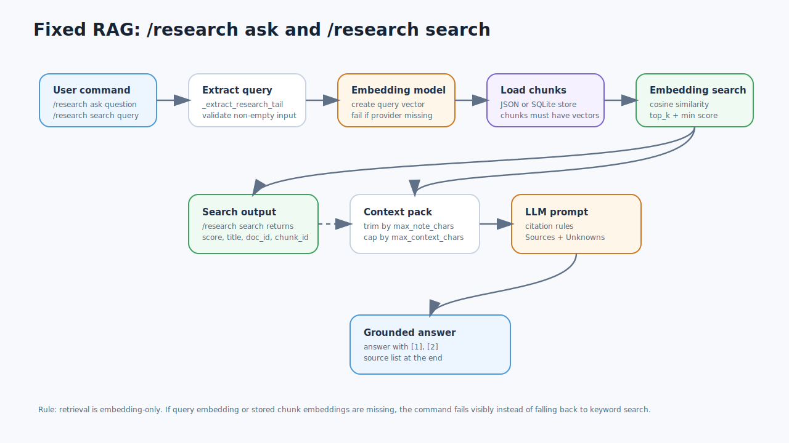
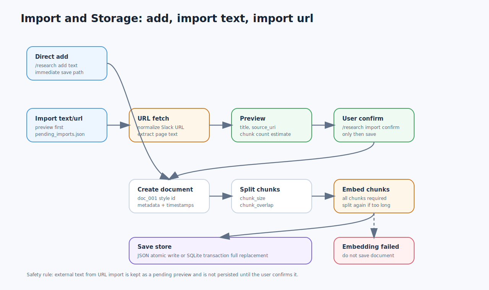
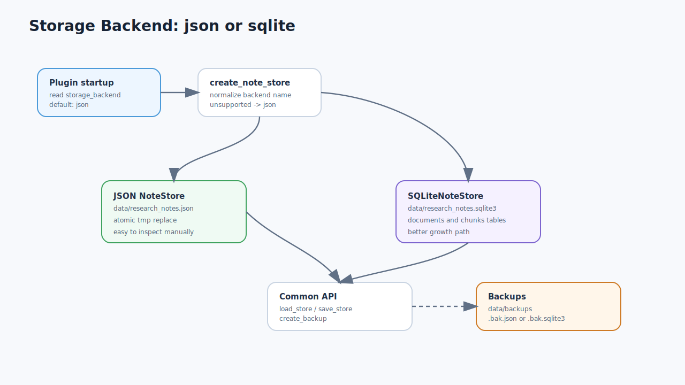
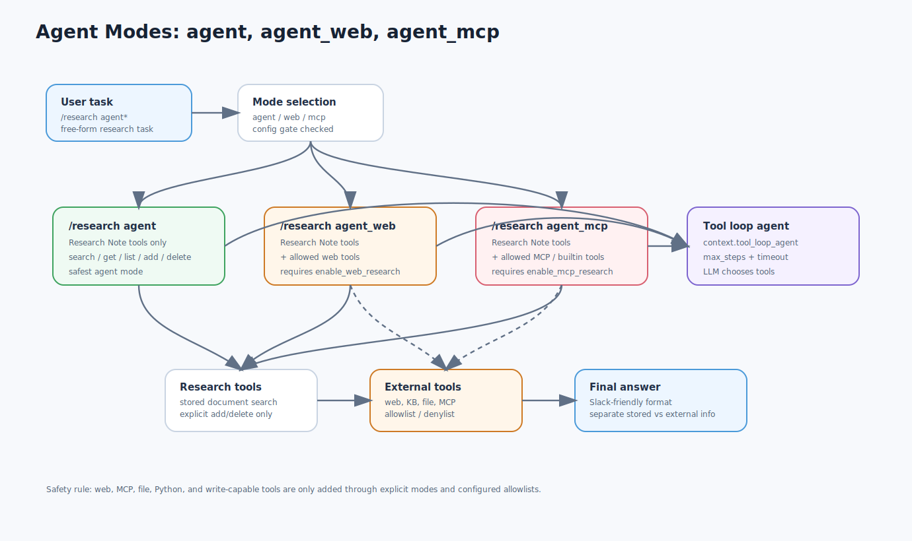
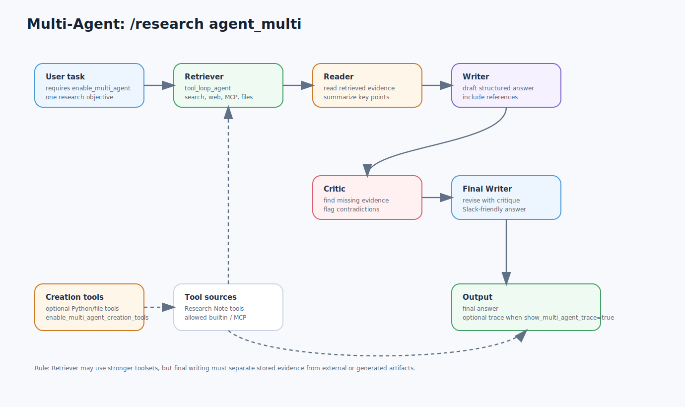

# Architecture Overview

このページは、Research Note Plugin の構造と動き方を図で説明するページです。

プログラミングに詳しくない方でも読めるように、「何が入力され、どこに保存され、どのように AI が答えるのか」を中心に説明します。

## 全体像


この図は、Research Note Plugin 全体の地図です。

左側の `User Side` は、ユーザーが Slack や Telegram などから `/research ...` という命令を送る場所です。

中央の `AstrBot Core` は、チャットから来た命令を plugin に届ける土台です。Research Note は AstrBot の plugin として動いています。

中央右の `Research Note Plugin` が、この plugin の本体です。ここで資料の追加、資料の検索、質問への回答、import、agent 実行などを処理します。

右上の `LLM Providers` は、AI の回答を作る chat model と、文章を検索用の数字に変換する embedding model です。

左下の `Research Storage` は、保存済み資料の置き場所です。現在は `research_notes.json` または `research_notes.sqlite3` を選べます。

右下の `External Research` は、Web Search、ページ抽出、AstrBot Knowledge Base、ファイル読み取り、Python 実行などの外部 tool です。これらは常に全部使うのではなく、設定で許可した場合だけ agent が使います。

この図で一番大事なのは、Research Note が「資料を保存する場所」と「資料に基づいて AI に答えさせる入口」の両方を担当している点です。

## Fixed RAG



この図は、`/research ask` と `/research search` の動きです。

`/research search <query>` は、AI に文章回答を作らせず、保存済み資料の中から近い chunk を探して表示します。

`/research ask <question>` は、まず保存済み資料から近い chunk を探し、その結果を AI に渡して回答を作ります。

検索では `embedding` を使います。embedding とは、文章の意味を数字のリストに変換したものです。似た意味の文章は、数字の距離も近くなります。

この plugin は keyword fallback を使いません。つまり、単語の一致だけで無理に探すのではなく、embedding が作れない場合や保存済み chunk に embedding がない場合は、エラーとして分かるようにします。

各ノードの意味です。

- `User command`: ユーザーが `/research ask ...` または `/research search ...` を送る入口です。
- `Extract query`: `/research ask` などの命令部分を除いて、本当に調べたい文章だけを取り出します。
- `Embedding model`: 質問文を embedding という数字のリストに変換します。
- `Load chunks`: JSON または SQLite に保存されている Document / Chunk を読みます。
- `Embedding search`: 質問の embedding と chunk の embedding を比べて、意味が近い資料を探します。
- `Search output`: `/research search` の場合は、ここで score、title、doc_id、chunk_id を表示して終わります。
- `Context pack`: `/research ask` の場合は、見つかった資料を短く整えて AI に渡す準備をします。AI に渡す参考資料セットのことです。
- `LLM prompt`: AI に「この資料に基づいて答えて」「参考文献を付けて」「分からないことは不明点にして」と指示します。
- `Grounded answer`: AI が根拠付きで回答し、本文中に `[1]` のような番号を付け、最後に参考文献を出します。

`/research ask` の最後では、AI に `参考文献` と `不明点` を含む prompt を渡します。これにより、根拠があることと分からないことを分けて答えさせます。

この流れは一番安定した基本機能です。agent より単純で、動作を予測しやすいです。

## Import And Storage



この図は、資料を保存する流れです。

`/research add <text>` は、ユーザーが貼り付けた文章をすぐ保存する入口です。

`/research import text <text>` と `/research import url <url>` は、いきなり保存せず、まず preview を作ります。preview では、タイトル、取得元、保存される内容の一部、chunk 数の目安を確認できます。

URL import では、Slack や Markdown 形式の URL も普通の URL に直してから取得します。HTML ページの場合は、title と本文らしい text を取り出します。

preview 後に `/research import confirm <pending_id>` を実行した時だけ、資料として保存されます。confirm するまでは `pending_imports.json` に一時保存されます。

保存時には、まず Document を作ります。Document は資料1件分の情報で、`doc_001` のような ID、title、source_uri、作成日時などを持ちます。

次に本文を Chunk に分けます。Chunk は検索しやすい短い文章の単位です。長い資料をそのまま検索するより、chunk に分ける方が根拠を示しやすくなります。

その後、すべての chunk に embedding を作ります。全 chunk の embedding 作成に成功した場合だけ保存します。途中で失敗した場合は、その資料は保存しません。

保存先は設定により JSON または SQLite です。どちらを選んでも、plugin のコマンドの使い方は同じです。

## Storage Backend



この図は、資料をどこに保存するかの流れです。

plugin 起動時に `storage_backend` を読みます。設定がない場合は `json` です。

`storage_backend` が `json` の場合、保存先は以下です。

```text
data/research_notes.json
```

JSON は普通のテキストファイルなので、人間が中身を直接確認しやすいです。資料数が少ないうちは分かりやすい保存方法です。

`storage_backend` が `sqlite` の場合、保存先は以下です。

```text
data/research_notes.sqlite3
```

SQLite は1つのデータベースファイルです。現在の実装では `documents` table と `chunks` table に、Document と Chunk の JSON を保存します。

JSON と SQLite は内部の保存方法が違いますが、plugin から見ると同じ `load_store`、`save_store`、`create_backup` で扱います。そのため、`/research add` や `/research ask` の使い方は変わりません。

`/research backup` を実行すると、現在使っている backend の backup が `data/backups` に作られます。

## Agent Modes



この図は、3種類の agent mode の違いです。

`/research agent <task>` は、Research Note 内の tool だけを使う agent です。保存済み資料の検索、document の確認、一覧表示、明示された場合の保存や削除ができます。

`/research agent_web <task>` は、Research Note tools に加えて、許可済み Web Search tool を使える agent です。設定の `enable_web_research` が true の時だけ使えます。

`/research agent_mcp <task>` は、Research Note tools に加えて、許可済み MCP tool や AstrBot builtin tool を使える agent です。設定の `enable_mcp_research` が true の時だけ使えます。

3つの agent は順番に実行されるものではありません。ユーザーが選んだコマンドに応じて、どれか1つの mode が実行されます。

agent の中では `tool_loop_agent` が使われます。これは、AI が「資料を探す必要がある」と判断した時に `research_search` などの tool を呼び、その結果を見て回答を作る仕組みです。

外部 tool は便利ですが、ファイルや外部APIに触れる可能性があります。そのため Web/MCP 系は通常 agent とは分け、設定で許可したものだけを渡します。

保存と削除は安全ルールがあります。`research_add_text` はユーザーが明確に保存を頼んだ時だけ使い、`research_delete_document` は `doc_id` と `confirm_doc_id` が一致した時だけ削除します。

## Multi-Agent



この図は、`/research agent_multi <task>` の動きです。

Multi-Agent は、1つの AI が全部を行うのではなく、役割を分けて順番に処理します。

最初の `Retriever` は、調査材料を集める役です。ここだけ `tool_loop_agent` を使い、Research Note tools、許可済み builtin tools、MCP tools、必要なら作成系 tools を使えます。

次の `Reader` は、Retriever が集めた材料を読み、重要な主張、比較点、矛盾、不明点を整理します。

次の `Writer` は、Reader の整理をもとに draft answer を作ります。

次の `Critic` は、draft answer に根拠不足、引用不足、資料にない断定、矛盾の見落としがないか確認します。

最後の `Final Writer` は、Critic の指摘を反映して最終回答を作ります。

この flow は `Retriever -> Reader -> Writer -> Critic -> Final Writer` の順番です。

`show_multi_agent_trace` を true にすると、最終回答だけでなく、途中の Retriever、Reader、Draft、Critique も出力に含めます。

`enable_multi_agent_creation_tools` が true の場合、Python 実行やファイル作成などの creation tools も Retriever に追加できます。これは強力なので、必要な時だけ使う想定です。

## 実装との照合メモ

このページの図は、以下の実装に合わせています。

- Commands: `main.py` の `/research add/list/show/ask/agent/agent_web/agent_mcp/agent_multi/import/search/delete/reindex/backup/clear`
- Tools: `research_search`、`research_get_document`、`research_list_documents`、`research_add_text`、`research_delete_document`
- Search: `search.py` と `tool_utils.py` の embedding-only cosine similarity
- Storage: `store.py` の `NoteStore` と `SQLiteNoteStore`
- Import: `pending_imports.py` と `importers/url_importer.py`
- Agent prompts: `agent_prompts.py`

## 守っている方針

- 保存済み資料は Document と Chunk に分けます。
- 保存する chunk には embedding を作ります。
- 検索は embedding-only です。
- Web/MCP/tool の外部情報は、保存済み資料と区別します。
- 外部情報は勝手に保存せず、import confirm または明示的な保存依頼を使います。
- 削除は確認付きで行います。
